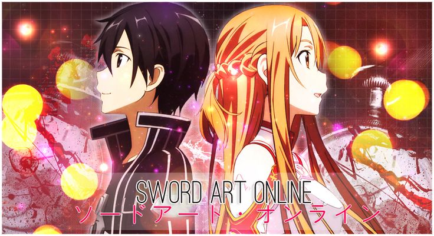

# 2024.1-SwordArtOnline

  

Repositório para desenvolvimento de um MUD inspirado em Sword Art Online da disciplina de SBD1 - 2024.1

## Alunos

| Nome                                                               | Matrícula |
| :----------------------------------------------------------------- | :-------: |
| [Douglas Marinho Martins](https://github.com/M4RINH0)              | 221037465 |
| [Henrique Torres Landin](https://github.com/henriqtorresl)         | 202016524 |

## Jogo

Após o acesso a um novo aparelho de realidade virtual, ao entrar no jogo Sword Art Online um mundo com diversos ambientes presentes em um tipo de edificio flutuante com 100 andares, todos os jogadores ficam presos nesse mundo cheio de inimigos e criaturas perigosas. Eles são informados que, caso morram no jogo, perderão suas vidas no mundo real. Para se salvar e voltar à realidade, você precisa derrotar todos os chefes dos 100 andares. Será que você tem o que é preciso?

### Como o jogo funciona?

Sword Art Online (SAO) é uma light novel famosa que teve uma adaptação em anime de grande sucesso, conquistando fãs ao redor do mundo. Nesse MUD, o jogador deve se equipar bem, coletar recursos e derrotar o chefe ("boss") presente em cada andar.

Você pode escolher entre classes como Espadachins, usando espadas; Assassinos, com adagas e lanças para eliminar seus alvos; ou Magos, utilizando cajados para lançar magias de ataque ou suporte.

Cada classe tem especialidades que auxiliam em batalha, melhorando atributos específicos. Escolha seus equipamentos com sabedoria de acordo com sua classe.

Explore os andares até encontrar a sala do chefe. Quando estiver pronto, enfrente-o para testar sua capacidade e força.

Os jogadores podem melhorar seus equipamentos ou trocá-los por itens mais raros. Melhor equipamento significa mais força e maior facilidade em derrotar os chefes de cada andar.

Em cada andar, você pode realizar várias missões que oferecem recompensas, como novos equipamentos ou dinheiro para negociar com NPCs.

Prepare-se para uma aventura intensa e emocionante, onde cada decisão pode significar a diferença entre a vida e a morte. Está pronto para o desafio? Entre no mundo de Sword Art Online e lute para sobreviver!

**No vídeo abaixo é possível ver o trailer do anime em que se baseia o jogo:**

## Apresentações

| Módulo | Link da gravação                                                                                    | Data       |
| ------ | --------------------------------------------------------------------------------------------------- | ---------- |
| 1      | [Apresentação Módulo 1](https://youtu.be/DtC8UW9KK5I)                                               | 22/07/2024 |
| 2      | [Apresentação Módulo 2]()                                                                           |      -     |
| 3      | [Apresentação Módulo 3]()                                                                           |      -     |
| Final  | [Apresentação Final]()                                                                              |      -     |

## Entregas

- Módulo 1

  - [Diagrama Entidade-Relacionamento](./docs/Entrega-01/DER_SAO_v1.0.md)
  - [Dicionário de Dados](./docs/Entrega-01/DD_SAO_v1.0.md)
  - [Modelo Entidade-Relacionamento](./docs/Entrega-01/MER_SAO_v1.0.md)
  - [Modelo Relacional](./docs/Entrega-01/MREL_SAO_v1.0.md)

- Módulo 2

  - [Normalização]()
  - [DDL]()
  - [DML]()
  - [DQL]()
  - [Álgebra Relacional]()

- Módulo 3

  - [Dinâmica do Jogo]()
  - [Histórias de usuários adaptado]()
  - [Stored Procedures, Triggers e Views]()

- Módulo Final
  - Jogo MUD

### Histórico de versões

| Versão |    Data    | Descrição                                      | Autor                                               | Revisão                                                      |
| :----: | :--------: | ---------------------------------------------- | --------------------------------------------------- | ------------------------------------------------------------ |
| `1.0`  | 21/07/2024 | Criação do README e enredo | [Douglas Marinho](https://github.com/M4RINH0)  | [Henrique Torres](https://github.com/henriqtorresl)          |
